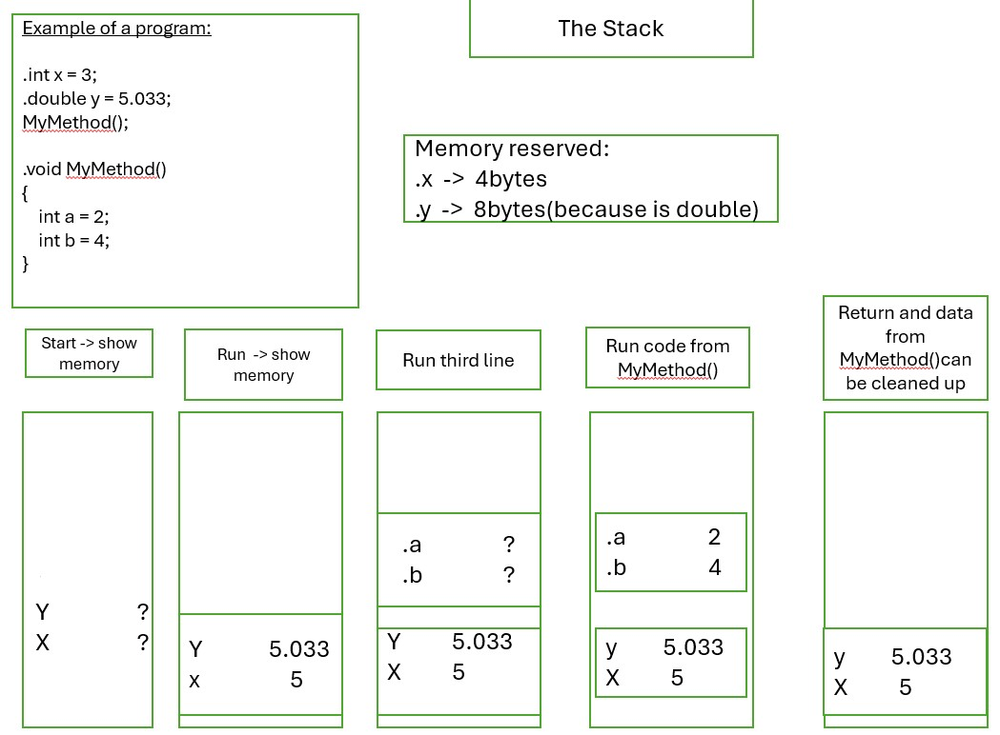
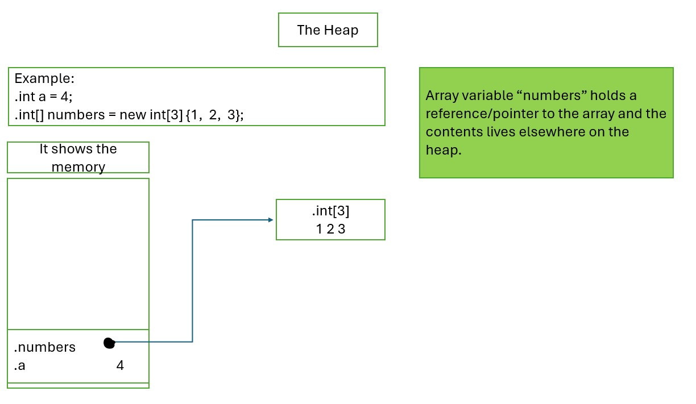

# Answer To Questions:

## Question 1) Answer:

- The <b>stack</b> is a model that allow us to allocate space for each method we call and then free or dellocate the memory when we are done using it as the flow of execution moves from one method to another.
	Ex.
	

- The <b>heap</b> does not have a specific order for memory allocation. 
	Objects can vary in size and are allocated dynamically during runtime.
	Objects in the heap are accessed through references or pointers.
	Memory for objects is allocated and deallocated dynamically as needed, allowing for flexible memory management.
	Ex.
	

## Question 2) Answer:
- Value Types store their data in the variable's location in memory. All the numeric types(int, double, etc.), boll and char are value types.

- Reference Types are string, array etc.

The difference between then:

- For value types two things are equal if their data elements are equal.
- For reference type two things are equal if they're the same location in memory.

## Question 3) Answer:

- In the method ReturnValue() there are two value types and then when y is assign another the value 4, x is having the same value of 3;
- In the method ReturnValue2() there are two objects, different objects, and they are both reference types.
Object y assign the value of object x. For this reason when object y assign a new value of 4 then the value on the heap is changing for both objects x and y.